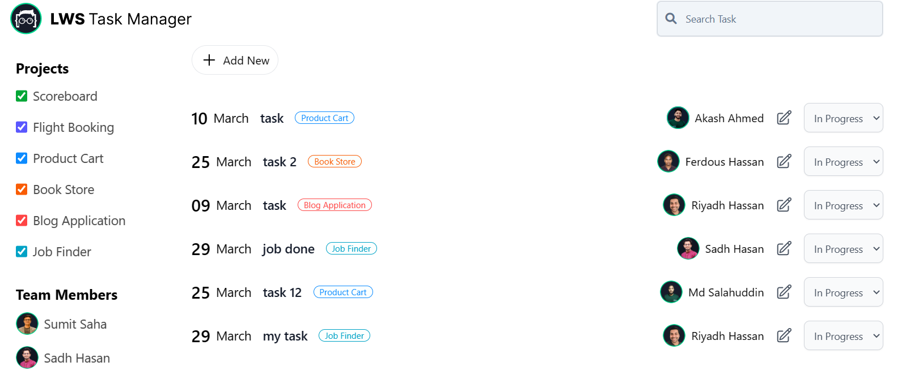
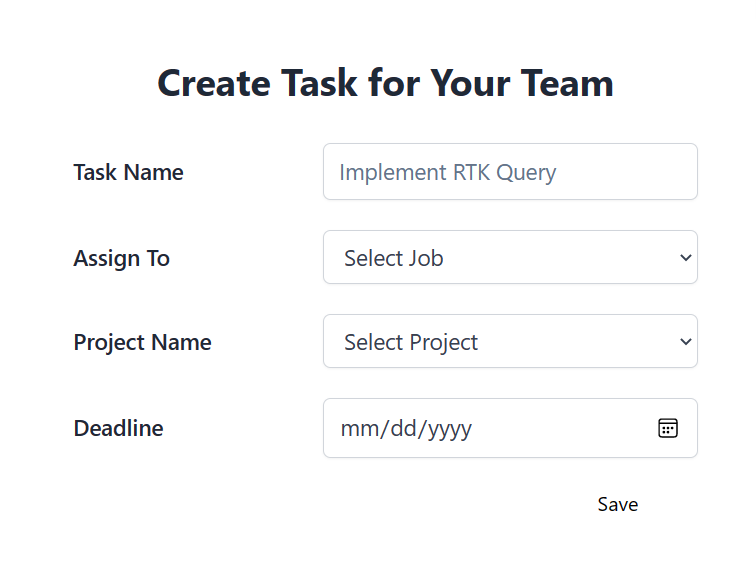
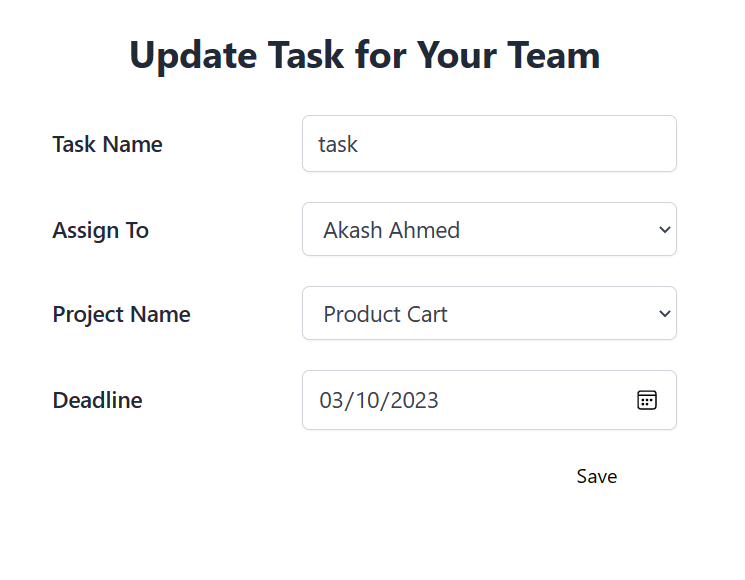

## Task Maneger Application

### Live Preview [Preview](https://task-manage-app-2.netlify.app/)

### Technologies used in this application

    🠪 JavaScript
    🠪 ReactJs
    🠪 Redux-toolkit
    🠪 React router dom (for routing purposes)

### Functionality

 

✓ Project list and team member list are fetch from server.

✓ Task list also fetch from server.

✓ You can change the status of the task.

✓ If the status of the task is complete then it can be deleted else it can only be edited.

✓ You can add a new task by clicking on the add new button

✓ You can filter tasks by their name in the search bar and also by their assigned project name by

select or unselect the project name.

### Backend Url

https://task-manager-b3k8.onrender.com/

### Web page screenshot

 

| Home Page                                                            |
| -------------------------------------------------------------------- |
|  |

| Add Page                                                | Edit Page                                                  |
| ------------------------------------------------------- | ---------------------------------------------------------- |
|  |  |
